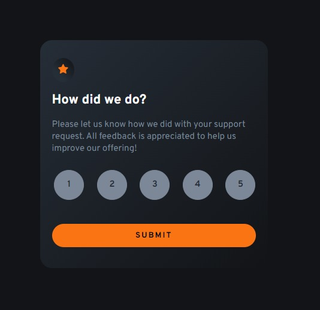
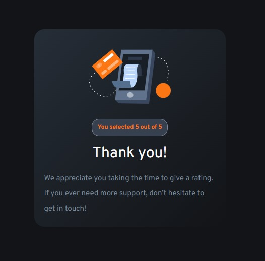

<h1 align="center"> Rating Component</h1>

  <a href="#-tecnologias">Tecnologias</a>&nbsp;&nbsp;&nbsp;|&nbsp;&nbsp;&nbsp;
  <a href="#-layout">Layout</a>&nbsp;&nbsp;&nbsp;|&nbsp;&nbsp;&nbsp;
  <a href="#memo-licença">Licença</a>

 
Meu objetivo com esse projeto foi praticar o desenvolvimento de interfaces e melhorar minhas habilidades. Considero que o desafio com este layout foi estilizar os inputs do formulário.

 

  

  

## 🚀 Tecnologias

Esse projeto foi desenvolvido com as seguintes tecnologias:

- HTML, CSS e JS
- Git e Github
- Figma
- Javascript

## 🔖 Layout

Você pode visualizar o layout do projeto através [DESSE LINK](https://www.frontendmentor.io/challenges/interactive-rating-component-koxpeBUmI). É necessário ter conta no FrontEnd Mentor para acessá-lo.

## :memo: Licença

Esse projeto está sob a licença MIT.

